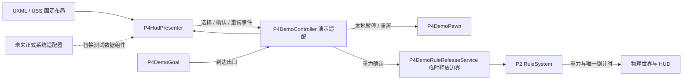

# P4 开发起步：关卡白盒、HUD 与规则拼装

本次交付实现 P4 可独立演示的部分，不新增 P1/P2/P3 的正式接口。重力的反转、失效、恒定、增强、削弱已接入 P2 的真实规则系统，会改变全局 `Physics2D.gravity`；其他属性仍使用 UI 测试数据，不改变摩擦或时间倍率。

## 打开与操作

1. Unity 导入完成后，打开 `Project-Rule/Assets/_Project/Scenes/Level_01.unity`，进入 Play Mode。
2. `A / D` 或左右方向键移动，空格跳跃。
3. `Tab` 或右下角按钮打开拼装界面；`Esc` 或“继续游戏”关闭。
4. 选择属性、关系，查看说明与消耗，点击“让它生效”。
5. 抵达右侧黑色出口，HUD 显示路线完成；`R` 或“重来”恢复出生位置与测试数据。

当前场景用于 **全词条 UI 验证**，开放规则矩阵的 7 个属性、5 个关系，共 **35 个组合**，不是正式第一关的解锁进度。每个组合的说明沿用 `Doc/规则矩阵.json` 原文；摩擦反转、摩擦增强、伤害/生命恒定、因果失效这 4 个未定稿组合也可以确认演示，预览会标注“策划未定稿”。

初始测试能量为 100，按 `R` 恢复能量并清空规则，可逐项检查选择、说明、扣费、同属性替换和 7 个槽位同时显示。能量不足仍会禁用确认按钮。重力当前使用 P2 资产的参数：每条消耗 20 能量、生效 10 秒、无冷却；以后修改正式资产会直接反映到演示。反转后角色会落向天花板，空格从天花板向下跳。

视觉采用黑白印刷与实体字块：拼装页没有外框卡片，属性与关系以有厚度、轻微倾斜的字块组成；HUD 与关卡白盒同样使用黑白灰。字体、间距和字块布局仍可在 UXML / USS 中手动调整。

演示角色采用策划案约定的 **Kinematic Rigidbody2D**：自行读取 `Physics2D.gravity` 积分速度，以碰撞扫掠限制位移，再调用 `MovePosition`。普通动态物件由物理引擎读取同一个全局重力。此角色仍是 Development 内的临时实现，正式控制器由 P3 接管。

演示场景使用 `Physics2D.simulationMode = Script`，在角色提交移动后手动 `Simulate(fixedDeltaTime)`。打开拼装界面停止物理模拟、P2 规则表计时和演示倒计时，不写 `Time.timeScale`。P1 的正式时间管理器落地后接管该演示暂停入口。

`P4 Demo` 负责此场景中 P2 规则系统的初始化、Tick 和释放生命周期，**不要再加第二个 `RuleSystemDriver` 或另一个物理模拟驱动器**。重力到期或按 R 时由 P2 清理；场景销毁时释放单例，并恢复进入场景前的重力与物理模拟模式。

## 手动调整的位置

| 调整内容 | 位置 |
|---|---|
| 地面、平台、边界、出口与出生点 | `Level_01` 场景中的 `Whitebox`、`Markers` 对象，直接调整 Transform / Collider |
| HUD 和拼装界面的固定层级、按钮文字 | `Assets/_Project/UI/P4/P4Hud.uxml`，可用 UI Builder 打开 |
| 色彩、间距、字体大小、边框、位置 | `Assets/_Project/UI/P4/P4Hud.uss` |
| 分辨率缩放 | `Assets/_Project/UI/P4/P4PanelSettings.asset`，参考分辨率 1280 × 720 |
| 测试生命、能量 | 场景中 `P4 Demo` 的 `P4DemoController` Inspector；运行时调整生命/能量后调用 Reset 或重进 Play Mode |
| 组合的说明、非重力费用/时长与未定稿标识 | `Assets/_Project/UI/P4/Resources/P4RulePreviews.json`；说明取自规则矩阵，非重力费用和时长是演示参数。重新进入 Play Mode 加载修改 |
| 正式重力的费用、时长、冷却与文案 | `Assets/_Project/Data/Rules/Gravity*.asset`；文案为空时使用规则矩阵原文 |
| 测试移动、跳跃速度 | `P4 Demo/DemoPawn` 的 `P4DemoPawn` Inspector |

固定元素都在 UXML 中，包括 7 个规则槽位、7 个属性按钮和 5 个关系按钮。运行时代码只选择、填数据、控制可见性与可用状态，不重建这些层级。属性和关系按钮的 `name`、规则行及其子标签的 `name/class` 是绑定标识，调整布局时请保留。

## 实现边界

- `RuleGame.UI`：`P4HudPresenter` 只提供 UI 查询、显示方法和交互事件，不持有玩家状态，不结算能量，不执行规则。
- `RuleGame.Development`：独立演示程序集，依赖 UI、Core、Infrastructure 和 Input System；测试角色、出口、规则预览数据与临时释放适配都在这里。
- `RuleGame.Editor`：场景资源创建工具和一次性的批处理验证入口。创建工具不会覆盖已经存在的 `Level_01`，也不会修改 Build Settings。

代码没有新增 `AttributeId`、`IRuleSystem`、`IEntityStatus` 等团队共享类型。演示的字符串 ID 与未来接口的适配由集成组件完成。

## 队友接口落地后的接法

当前已同步接口冻结文档 v3.0：共享规则接口位于 `Infrastructure/Shared/Rules/`，重力已绑定 P2 的规则核心，另外 30 个组合仍为 UI 演示。P2 原目录目前只引用反转，因此演示单独使用 `UI/P4/Resources/P4GravityDemoCatalog.asset` 引用已有的 5 条重力资产，不改动队友目录。

P3 的正式释放服务尚未落地，当前使用 Development 内的 `P4DemoRuleReleaseService`：检查能量与冷却 → 调用 P2 → 成功后才扣费、进入冷却。它不定义新的团队接口；P3 的 `RuleReleaseService` 落地后替换此临时边界。原 `IRuleRelease` 已删除。

| 真实系统 | 接入位置 |
|---|---|
| P3 玩家状态 | 订阅生命/能量变化，调用 `SetVitals`，首次绑定时立即读取当前值 |
| P2 规则表 | 激活/过期事件更新 `SetActiveRule` / `ClearActiveRule`，剩余时间直接读规则表 |
| P2 规则定义与词条解锁数据 | 调用 `SetChoiceAvailable`、`SetCombinationCount`、`SetPreview`；计数只包含实际可用组合 |
| P3 `RuleReleaseService` | 订阅 `OnConfirmRequested`，把字符串 ID 转换为正式枚举，通过 `CanRelease` 更新按钮，确认时调用 `TryRelease(attr, rel, RuleSource.Player)`；成功后关闭界面，失败后提示原因。费用与冷却由服务在规则成功后结算 |
| P1 暂停 | 订阅 `OnAssemblyVisibilityChanged`，通过时间管理器申请/释放暂停 |
| P1 关卡流程 | 用正式终点组件替换 `P4DemoGoal`，通知 `ILevelFlow.NotifyGoalReached()` |
| P3 玩家控制器 | 在出生点放置正式玩家，移除 `DemoPawn` |

接入后移除场景中的 `P4DemoController`、`P4DemoPawn`、`P4DemoGoal`，以正式适配器接管显示与交互。若删除整个 Development 程序集，也应同步移除依赖它的两个 P4 Editor 工具及 Editor asmdef 中的引用。

重力的槽位、同属性覆盖和倒计时只由 P2 维护；UI 读取规则表并订阅变化事件，没有第二份重力计时器。其他属性的同属性覆盖和倒计时仍是 UI 测试数据。

## 资源与许可

- 白盒方块纹理由创建工具生成，不使用第三方图像。
- 中文字体使用 Noto Sans CJK SC；字体、SIL OFL 1.1 原文和来源说明都在 `Assets/_Project/UI/Fonts`。
- 未导入外部插件，未改动项目包依赖、输入资源或 Build Settings。

## 验证入口

`RuleGame.Editor.P4.P4DemoValidation.BuildAndValidate` 仅允许在**独立的临时工程副本**里以 Unity batch mode 执行，避免切换用户正在编辑的场景。它逐项检查 35 个组合的预览和确认、4 个未定稿提示、7 个槽位同时显示、完整词条布局，并保留扣费、能量不足、同属性覆盖、暂停恢复、组件反复启用、终点触发与重试检查，输出 HUD / 拼装界面的截图。

批处理通过不等同于手感与设备适配验收。移动端触控移动、正式输入映射、其他属性的世界规则以及完整队友系统联调均留待接口落地。

`RuleGame.Editor.P4.P4DemoValidation.ValidateGravityIntegration` 仅检查本次重力接入的风险：5 个关系从 UI 到物理世界、正式扣费、运动学角色与动态物件读取同一个重力、天花板跳跃、地面与墙壁碰撞、暂停物理与计时、到期恢复、能量不足、重置和销毁清理。
