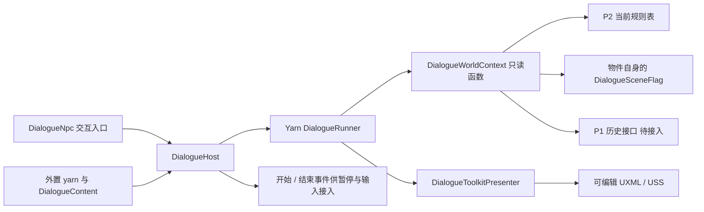

# Yarn Spinner 3 台词系统接入

首版按策划案 8.2 / 8.3 实现 NPC 台词：3 个内容入口、34 条外置正文（含兜底）。路边的人不愿挪窝，看门的人盼着下班，记事的人总在改稿。Yarn Spinner 负责条件求值和执行，项目代码只负责状态读取、引用校验、交互入口和 UI Toolkit 显示。人物经历仍是示例，正式世界观由策划确认。

## 试播

1. 打开 `Assets/_Project/Scenes/DialogueLab.unity`，进入 Play Mode。
2. 点击任一 NPC 按钮，阅读台词。逐字显示时点「继续」显示整句，再点进入下一句；全部正文读完后才结束本轮。「结束交谈」或 UI 获得焦点时按 Escape 立即终止。
3. 点击「重力反转」，再询问 NPC，选句应变为当前重力对应的内容。点击「清空规则」或等待规则到期，再询问，应回到泛用台词。未接入历史时不会播放回顾句。

点击 **看门的人**，演示一个人连续说话：第一句随当前规则选择，随后五句讲他的看门差事。整轮只启动一次 Yarn Runner，开始/结束事件也只各发一次。P2 尚未初始化时，独立兜底节点同样保留六句。

试播场景使用独立的 `DialogueLabRules.asset`，直接调用 P2 规则请求以构造测试状态。它不作为玩家释放规则的实现；正式释放仍交给团队的能量、冷却服务。试播控件销毁时恢复进入场景前的重力。

资源丢失时执行菜单 **RuleGame → Dialogue → Create Assets and Lab**。工具仅生成缺失的资源，不覆盖已有 Prefab、内容资产或试播场景，也不改 Build Settings。Yarn 包通过 Unity Package Manager 安装，Git 地址固定为 `https://github.com/YarnSpinnerTool/YarnSpinner-Unity.git#v3.2.8`。

## 接到正式场景

1. 将 `Assets/_Project/UI/Dialogue/DialogueSystem.prefab` 拖入场景。一个场景内的 NPC 通常共享一个 Host，避免多个 Runner 抢同一个对话窗口。
2. 在已有 NPC 对象上添加 `DialogueNpc`，指定 Host，从「台词入口」下拉框选择 NPC，调整交互半径和重复交互间隔。
3. P3 的交互代码在按键触发时调用 `npc.TryInteract(playerTransform)`。返回 `true` 才表示成功开播；距离外、阅读中、冷却中或内容错误均返回 `false`。场景事件也可调用 `Speak()`，此入口不检查玩家距离。

没有接入玩家输入时，可以在 Play Mode 的 NPC Inspector 点击「试播当前 NPC」。本功能没有替 P3 新建输入系统或角色控制器。



## 作者修改台词

文件在 `Assets/_Project/Data/Dialogue/NpcBarks.yarn`。`NpcBarks.yarnproject` 配置编译源文件；`DialogueContent.asset` 配置同一组源文件引用、NPC ID、入口节点和独立兜底节点。增加源文件时，两处都要添加引用。

```yarn
title: Observer
---
=> 路边的人: 这回坐下可费劲了。 <<if world_ready() and rule_active("Gravity", "Revert")>> #line:observer_revert
=> 路边的人: 坐会儿？这块地暂时归我。 #line:observer_generic
===

title: ObserverFallback
---
路边的人: 坐会儿？这块地暂时归我。 #line:observer_fallback
===
```

- 入口使用一个 line group，保留至少一条无条件候选。Host 使用 Yarn 的 `BestSaliencyStrategy`，优先选满足条件的具体状态台词。
- 同一人物要说多句，直接在节点内逐行写正文，每句使用独立 `#line` ID。`Caretaker` 示例在 line group 后续写五句，UI 会逐句接收；不用连调 `TrySpeak()`，也不用新建播放器。多句兜底可同样逐行写正文。
- 独立兜底节点保留无条件正文。当 P2 尚未初始化，Host 直接使用该节点，避免把「世界未加载」误当成「没有生效规则」。
- `#line` ID、NPC ID、节点名保持唯一、稳定。正文中的人物名前缀决定 UI 显示名称；内容资产的 `DisplayName` 用于 Inspector 的入口选择标签。
- 变量必须用 `<<declare $name = 初始值>>` 显式初始化。使用规则和场景函数时，用字面量 ID，便于启动期校验，避免动态拼接名称。
- 当前 Presenter 面向短句，只显示人物、正文、继续和关闭。玩家选项 `->` 会被校验拒绝；未来增加分支选择时，应接入 Yarn 的选项 Presenter。富文本样式、语音和存档不包含在首版交付中。

在 Project 窗口选中 `DialogueContent.asset` 后执行 **RuleGame → Dialogue → Validate Selected Content**。Yarn 导入器检查语法；项目校验补充未知规则枚举、未声明变量、重复台词/节点/NPC ID、缺失入口和无条件兜底。Host 启动时还检查场景物件和历史适配器引用。作者错误会明确报错并拒绝开播，需要修正内容。

| Yarn 函数 | 数据来源与含义 |
| --- | --- |
| `world_ready()` | 当前已绑定的 P2 规则系统是否可用 |
| `rule_active("Gravity", "Revert")` | 当前规则表的属性格位是否为指定关系 |
| `rule_present("Gravity")` | 当前属性格位是否仍有规则；回顾句用它避免压过当前状态 |
| `history_ready()` | P1 历史适配器已接入且完成加载 |
| `rule_seen("Gravity", "Revert")` | 由 P1 提供的已发生激活历史，未接入时返回 false |
| `scene_flag("door_open")` | 绑定物件自己的布尔状态，未匹配时返回 false 并在启动校验报错 |

当前状态每次由函数直接读取 P2 规则表，覆盖、过期和读档后无需维护另一份缓存。正式组合根可调用 `DialogueWorldContext.BindRules(IRuleSystem)` 注入现有服务；留空时读取项目已有的 `RuleSystem.Instance`。

物件状态：将 `DialogueSceneFlag` 挂到相关物件，设置唯一 `key`，放入 Host 的 World Context 数组。物件在开关、破坏等真实事件发生时调用 `SetValue(bool)`；不在对话代码中根据重力猜测门是否已打开。

## 留给队友的接口

| 接管方 | 已预留入口 | 目前行为 |
| --- | --- | --- |
| P1 历史 / 存档 | `IDialogueHistorySource`：`IsReady`、`TryHasActivated` | World Context 的 History Source 留空，历史函数返回 false |
| P1 暂停 / P3 输入 | Host 的 Inspector `On Started` / `On Finished`、C# `PlayingChanged(bool)` | 事件发出；不自动暂停世界、锁定玩家或修改 `Time.timeScale` |
| P3 交互 | `DialogueNpc.TryInteract(Transform)` | 检查距离、冷却、共享 Host 忙碌状态 |
| P2 规则 | World Context 读 `IRuleSystem.Table` | 已接当前规则，不写入、不结算能量 |
| 场景物件 | `DialogueSceneFlag.SetValue(bool)` | 由实际物件脚本更新，不生成虚假物件状态 |

历史适配器应是实现 `IDialogueHistorySource` 的 MonoBehaviour，直接查询正式存档；不要在此处自行监听激活事件攒另一份历史。历史句同时要求 `history_ready()`、`rule_seen(...)`，并排除该属性仍有生效规则的情况，只用于回顾。

暂停或输入适配器应保存自己取得的锁/令牌，并在完成事件释放。关闭、禁用和正常完成都能结束本次播放；重复完成回调不会重复通知。显示器使用非缩放时间，团队暂停世界后仍可读完和推进台词。

## 文件与验证

运行逻辑在 `Scripts/Gameplay/Scene/Dialogue`，显示适配在 `Scripts/UI/Dialogue`，生成与作者工具在 `Scripts/Editor/Dialogue`，试播控件在 `Scripts/Development/Dialogue`。它们使用独立 asmdef，正式对话没有依赖 P4 白盒控制器。UI 使用独立的 `DialogueChineseFont.asset`，随模块分发 Noto CJK 源字体和 OFL 许可；固定结构和样式可在 UI Builder 修改。

合并后先让 Unity 完成 Package Manager 解析和 Yarn 导入，再打开试播场景。正式运行模块依赖项目现有的 `RuleGame.Infrastructure`、`RuleGame.Core` 和 Yarn；UI 单独放在 `RuleGame.Dialogue.UI`，可替换为另一套 Presenter。试播组件位于 `RuleGame.Dialogue.Lab`，不会被正式 NPC 或 Host 引用。默认从已有 P2 单例读取当前规则，团队更换初始化方式时只需通过 `BindRules` 注入。

批处理验证仅在可丢弃的工程副本运行，入口是 `RuleGame.Editor.Dialogue.DialogueValidation.Run`，输出由环境变量 `DIALOGUE_VALIDATION_OUTPUT` 指定。验证覆盖实际 Yarn 选句、五种重力状态、无 P2 兜底、过期后的泛用句、无历史误报、逐字推进、关闭/禁用取消、事件配对、NPC 距离和冷却。它会切换场景并退出该副本编辑器，请勿在正在编辑的原工程运行。正式关卡的玩家交互和暂停行为需要在队友系统接入后再验收。

只检查多句示例时用 `RuleGame.Editor.Dialogue.DialogueValidation.ValidateConversation`：验证正常与无 P2 兜底各六句，逐句继续时 Host 不结束、不重新发开始事件，最后一句完成才结束；另检查第三句关闭后不会继续播剩余内容。
